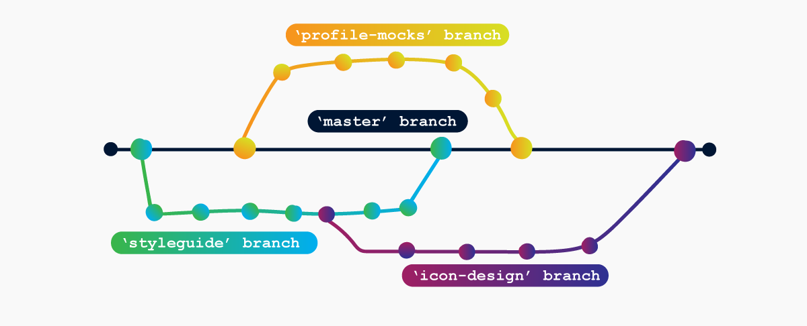

# WDI for UXDI

## Understanding Developers

### **Developer Roles**

- **Fullstack Web Developer**
  - Works in both developing the Client facing side and Server facing side.
- **Front End Web Developer**
  - Works on the client facing side dealing mostly with HTML, CSS, and Javascript following design patterns handed to them from design team. They are often responsable for connecting the client facing side to the back via API calls.
- **Back End Web Developer**
  - Works on the backend server facing side. Responsible for maintaining the site's database structure and ensures the site is constantly up and running with minimal down time. 

There are many types of web developer roles, but most can fit into these three catagories. [Here are some examples.](https://blog.codeplace.com/all-the-job-titles-you-can-have-as-a-developer-f16c5f1f1380)

### **Developer Tools**

**CLI / BASH / Terminal  **

[Terminal Cheat Sheet](https://gist.github.com/LeCoupa/122b12050f5fb267e75f)

**Code Editors </>**
  - [Visual Studio Code (New hotness)](https://code.visualstudio.com/)
  - [Sublime Text](https://www.sublimetext.com/)
  - [Atom](https://atom.io/)

**GITHUB **

**What is it?**

Github is a source managment system that is hosted online for remote version control.

[Github Example](https://github.com/nodejs/node)

