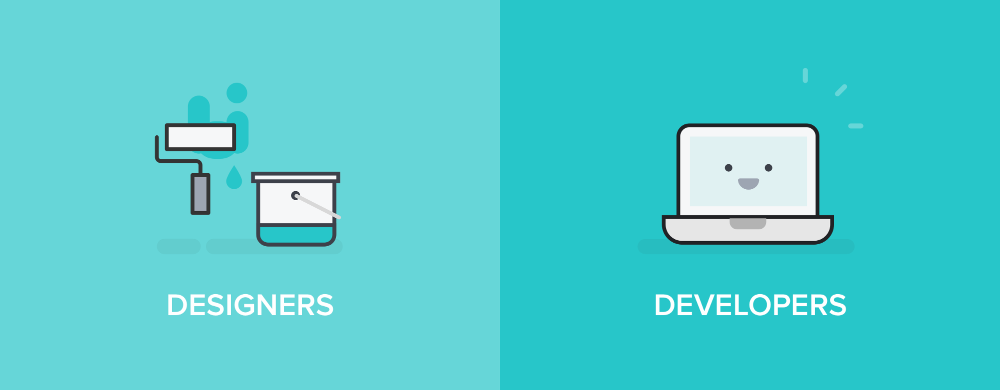
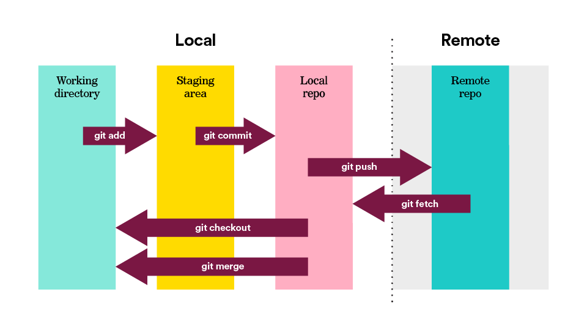
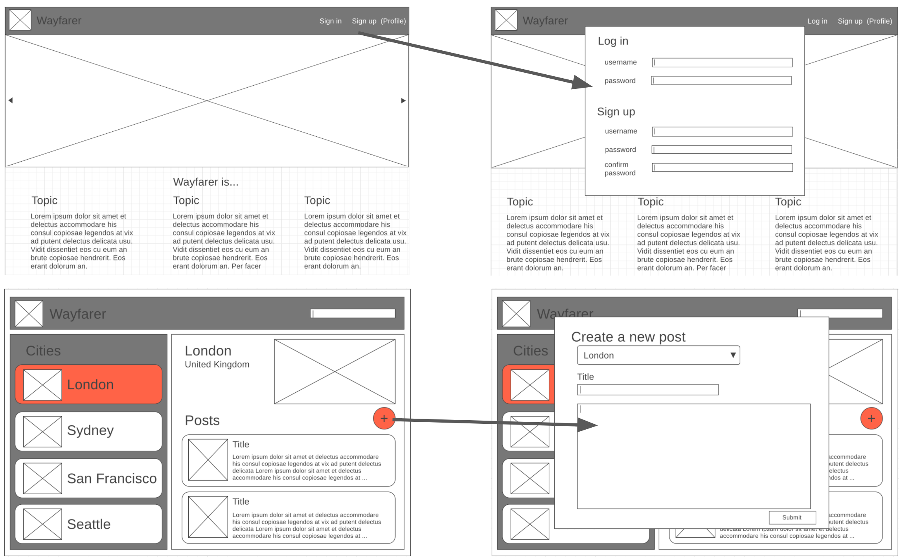
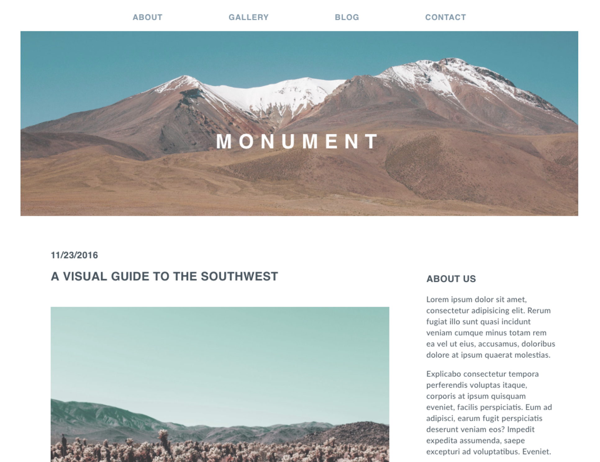
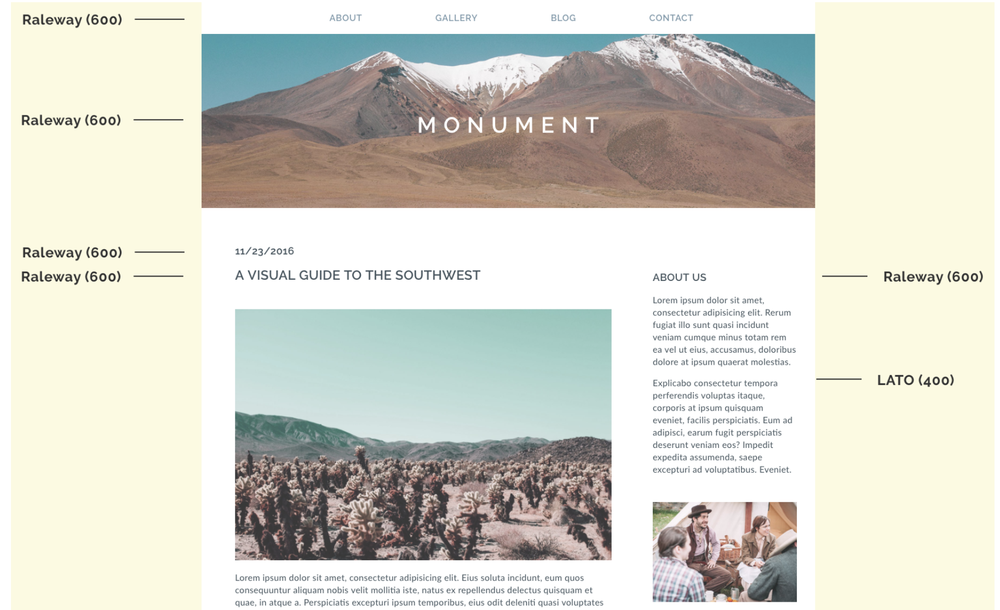

# SEI for UXDI



## Understanding Developers

[Let's start here.](https://www.youtube.com/watch?v=ocwnns57cYQ&feature=youtu.be)

### **Developer Roles**

- **Fullstack Developer**
  - Develops both the client-facing side and server-facing side.
- **Front-end Web Developer**
  - Works on the client facing side dealing mostly with HTML, CSS, and Javascript following design patterns handed to them from design team. They are often responsible for connecting the client facing side to the back via API calls.
- **Back-end  Developer**
  - Works on the back-end (server-facing) side. Responsible for maintaining the site's database structure and ensures the site is constantly up and running with minimal down time. 

There are many types of web developer roles, but most can fit into these three categories. [Here are some examples.](https://blog.codeplace.com/all-the-job-titles-you-can-have-as-a-developer-f16c5f1f1380)

### **Developer Tools**

**CLI / BASH / Terminal  **


[Terminal Cheat Sheet](https://gist.github.com/LeCoupa/122b12050f5fb267e75f)

**Code Editors </>**
  - [Visual Studio Code (New hotness)](https://code.visualstudio.com/)
  - [Sublime Text](https://www.sublimetext.com/)
  - [Atom](https://atom.io/)


**GITHUB **

**What is it?**

GitHub is a source management system that is hosted online for remote version control. For developers it allows us to create clones, backups, and work together on our software. Some alternatives you might see out there are Gitbucket, GitLabs, and Source Forge.

How GitHhub works:



Branches with GitHub:


[GitHub Example](https://github.com/nodejs/node)

### **Browser Dev Tools**

Built right into our browsers are powerful development tools! Check them out with: 

right click -> Inspect

View -> Developer -> Developer Tools

Option + Command + i


### **Documentation and Google**

Most developers will tell you that a large chunk of their development time is spent in research, diving into documentation and digging through google search results, to find what they are looking for. 

## How to Work and Communicate Effectively With Developers

### **Provide an adequate level of documentation.**

Developers LOVE documentation. Nothing is scarier to a developer than a blank canvas. Leave notes and descriptions of everything in your design layouts to ensure there is no miscommunication on what something is supposed to be/do.

Below we have a basic wireframe example. With no documentation we can see how open it is for interpretation. 


Here we have a little more direction with colors and general spacing, but still no documentation to help decide things like exact color, font, etc.



Finally! We have a wireframe with some documentation. This lets the developer know what font they will be using, the line height, font weight, etc.



If you do all of this your dev team will be *oh so happy*, and you will be happy in knowing that your guidelines are not up to interpretation.

### **Be decisive.**

Once again - nothing scares a developer more than a blank canvas. With clear and precise directions, most developers will follow them through to a tee and deliver a final product. Programmers are by nature **not** design-oriented. This occurs due to the technical critical thinking that is important to strong development. So be decisive in your designs and own them. If you are seeking input about functionality or overall appeal of the design feel free to include your developer to create a strong bond, but don't leave your designs open for interpretation. This only slows down development time overall.

### **Communication is key, so be available to clarify.**

Your developer will have questions about your designs and documentation. Never expect your developer to know all of your lingo, regardless of how simple it is. Be open to answering questions that they will have - even if they seem like they are already intuitive.

For example: 
```
"What is this arrow supposed to represent on the bottom of the profile page?" 
```

### **Set realistic deadlines, and stick to them.**

Time blocking and sprints are a developer's best friend. If you are taking the time to ensure you are hitting the sprints on time and sticking to your deadlines this will ensure your developers have plenty of time to work on their code. The more time a developer has, the more time that is open for development, testing, and deploying. 

### **Test it yourself.**

Don't rely solely on your developer's code. A second pair of eyes and hands will find bugs and ensure that *your* design is coming together. If you do find a bug or an unexpected design shift in the site's functionality let your developer know immediately. 

## Time to step into the shoes of a developer.

### How does the internet work? 

The flow of the internet is directed via this: 

Client goes to their browser and types in Google.com -> The browser sends this **request** to a DNS server and translates the Google.com to an **IP Address** -> With this information the browser and connect directly to the **web server** holding holding all the code for the site. -> The **web server** checks it **database** for information that is persistent across the site and sends it back to the **web server** -> from there the **web server** sends the final site back to the **client side web browser**. 

A lot of work for you to look at cat gifs.


Here is a general flowchart.


### **The languages that make up the web.**

  - **HTML**
    - The *"structure"* of a web site.
  - **CSS**
    - The *"design"* portion of a web site.
  - **Javascript**
    - The *"functionality"* of a web site.

### **HTML**

HTML stands for *Hyper Text Markup Language*. There are two main areas to an HTML Document. The Head and the Body.

The **Head** holds the meta data of the site. This includes links to other files and important information including how to detect the screen size.

```html
<head>
    <meta charset="utf-8" />
    <meta http-equiv="X-UA-Compatible" content="IE=edge">
    <title>Portfolio</title>
    <meta name="viewport" content="width=device-width, initial-scale=1">
    <link rel="stylesheet" type="text/css" media="screen" href="main.css" />
    <script src="app.js" defer></script>
</head>
```

The **Body** holds the *rendered* content of the website. This is what the user will see and interact with. This in most cases have an internal split of a **Header**, **Main**,and **Footer**.


Let's breakdown a simple static one page portfolio site.

```html
<body>
    <header>
        <Nav>
            <a class="menu" href="#">Home</a>
            <a class="menu" href="#">Projects</a>
            <a class="menu" href="#">Contact</a>
        </Nav>
    </header>
    <main>
        <section id="hero">
                <h1>Welcome to my portfolio!</h1>
                <p>Take a look at all my cool stuff!</p>
        </section>
        
        <form action="post">
            <input type="text" placeholder="You can type stuff here!">
            <button type="submit">Submit</button>
        </form>
    </main>
    <footer>
        <p>&copy; 2018</p>
    </footer>
</body>
```
To tell our document which version of HTML to use we have to add the following around our **head** and **body** :

```html
<!DOCTYPE html>
<html>
  <!-- Code inside here -->
</html>
```
When we put it all together we get: 

```html
<!DOCTYPE html>
<html>
<head>
    <meta charset="utf-8" />
    <meta http-equiv="X-UA-Compatible" content="IE=edge">
    <title>Portfolio</title>
    <meta name="viewport" content="width=device-width, initial-scale=1">
    <link rel="stylesheet" type="text/css" media="screen" href="main.css" />
    <script src="app.js" defer></script>
</head>
<body>
    <header>
        <Nav>
            <a class="menu" href="#">Home</a>
            <a class="menu" href="#">Projects</a>
            <a class="menu" href="#">Contact</a>
        </Nav>
    </header>
    <main>
        <section id="hero">
                <h1>Welcome to my portfolio!</h1>
                <p>Take a look at all my cool stuff!</p>
        </section>
        
        <form action="post">
            <input type="text" placeholder="You can type stuff here!">
            <button type="submit">Submit</button>
        </form>
    </main>
    <footer>
        <p>&copy; 2018</p>
    </footer>
</body>
</html>

```

When our page renders out we are greeted with the following: 


#### *YIKES!* 

That is not looking very good. Time to bring in CSS!

### **CSS**

CSS stands for Cascading Style Sheet. CSS tells our browser how to render our HTML elements.

#### **Initial Styles**

Keep in mind that, even without CSS, your site has design. It's not very good design, but design decisions have been made nonetheless. What styles can you identify?

- White background
- Black color
- Times New Roman font
- Left text alignment
- Bold headers
- Blue, underlined links
- Round, solid black bullets for list items
- Predetermined font sizes
- Predetermined margin and padding
- Predetermined display (inline vs. block)

This is a fallback in case our CSS fails to load on the page. With the power of CSS selectors we can grab specific elements and apply styling. Let's style our portfolio page.

Let's look at the syntax for CSS. 

```css
selector {
    property: value;
    property: value;
    property: value;
}
```

Lets grab our header and apply some simple styles.

```css
* {
    box-sizing: border-box;
}
body{
    margin: 0;
}
header{
    width: 100vw;
    background-color: green;
}

```
We **selected** a few different things here. `*` is a universal selector. We grabbed everything in the document and set its box-sizing to border-box. (This prevents weird margin and padding issues.) Then we grabbed the body and reset the margin to 0 on all sides to fill the application page. Finally we grabbed our header and set its width to 100 visual width and gave it a background color! 

Let's add some more properties to make it look "better."

Let's break down what we see here:

```css
header{
    width: 100vw;
    height: 5vh;
    background-color: green;
    padding: .2em;
}

.menu {
    margin-left: .3em;
    font-size: 1.5em;
    color: white;
    text-decoration: none;
}
.menu:hover {
    background-color: aqua;
    color: black;
}

```
Now, let's tackle the rest of the page!

```css
* {
    box-sizing: border-box;
}
body{
    margin: 0;
}
header, footer{
    width: 100vw;
    height: 5vh;
    background-color: green;
    padding: .2em;
}

.menu {
    margin-left: .3em;
    font-size: 1.5em;
    color: white;
    text-decoration: none;
}
.menu:hover {
    background-color: aqua;
    color: black;
}

main {
    padding: 0 1em;
}

#hero {
    text-align: center;
}

img{
    margin: 0 auto;
    width: 97vw;
}

form {
    display: flex;
    flex-direction: column;
    width: 40vw;
    margin: 1em auto;
    border: 2px black solid;
}
form input, form button{
    height: 5vh;
}

footer p {
    margin: 0;
    margin-right: 1em;
    text-align: right;
    color: white;
}
```
This site may not be pretty, but that's where you come in! When you have some time, continue to play around with the HTML and CSS to get things to move the way you want. You will find out really fast that manipulting elements take a lot of practice. This is why it is so important that when designs come in to the developer that information like margin sizes and padding can really speed along development. The less guess work a developer has to do on sizing the more he can focus on his code.

Overall, CSS is a tricky thing to master. Even seasoned front-end engineers run into their own CSS issues from time to time. 


There are so many CSS properties it is impossible to memorize them all. Developers often look at documentation to find what they are looking for.

[CSS MDN Documentation](https://developer.mozilla.org/en-US/docs/Web/CSS)

And just like that you have learned the fundamentals of HTML and CSS! 


